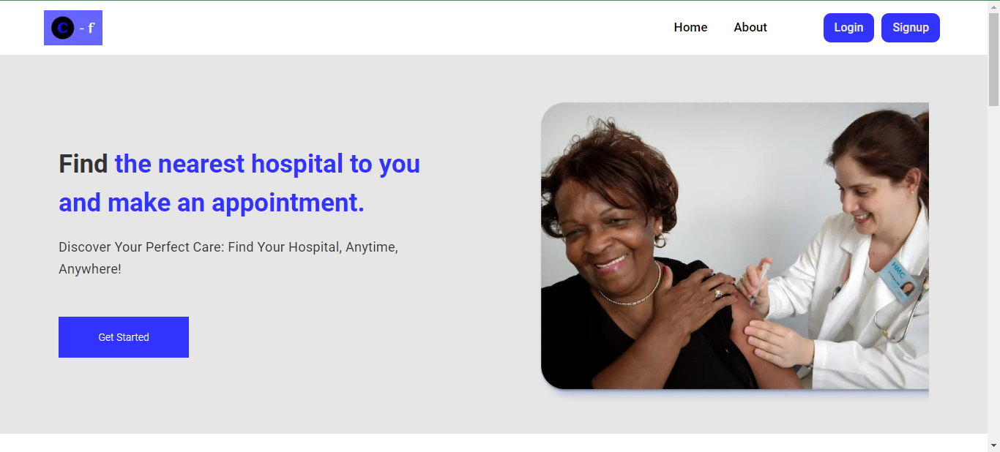

# CareFinder



In this project, I fetched my Github repositories and some details using Github API, I used react-router to implement nexted routes, 404 page, I also set up Error boundary, custom hooks, and iplemented SEO as instructed in the examination question

## Authentication

Authentication is done with NextAuth Library.

## Main Files: Project Structure

```
├── README.md
├── public
├── app
├── components
├── config
├── cypress
├── hooks
├── library
├── pages
├── store
├── gitignore
└── package.json
```

## Getting Started

This is a [Next.js](https://nextjs.org/) project bootstrapped with [`create-next-app`](https://github.com/vercel/next.js/tree/canary/packages/create-next-app).

### Pre-requisites and Local Development

The prerequites tools for local development are:

- NodeJs

### Frontend

The app is built with NextJs version 13.4 so there is need to install the frontend dependencies using Node.js and NPM

You can confirm if Node.js and NPM is installed successfully using the codes below

```
node -v
npm -v
```

From the carefinder folder, run the following commands to start the client:

```bash
npm install # run this once to install all dependencies
# then
npm run dev
# or
yarn dev
# or
pnpm dev

```

By default, the frontend will run on `localhost:3000`.

## Deployment

The app is deployed on Vercel https://care-finder-iota.vercel.app/

## Author

Joel Ojerinde

## Acknowledgements

AltSchool Africa
